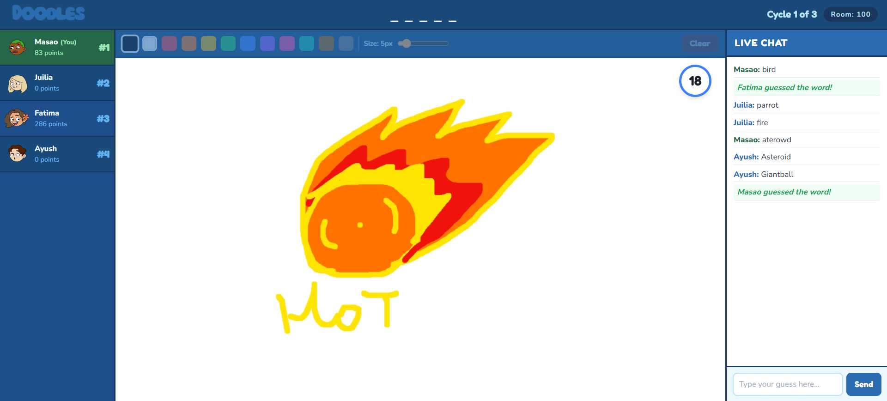

# ✏️ Doodles

**Doodles** is a fast-paced, real-time multiplayer drawing and guessing game built for the modern web. Inspired by classics like Skribbl.io, Doodles brings people together to challenge their creativity and speed in a fun, competitive environment.

## [Live Demo](https://doodles-u7qb.onrender.com)


---

## ✨ Features

- **🚀 Real-time Multiplayer**: Powered by Socket.io for near-zero latency drawing and chatting.
- **🖌️ Dynamic Canvas**: A smooth drawing experience with customizable colors and brush sizes, optimized for both desktop and mobile touch.
- **🕒 Round-Based Gameplay**: Integrated game logic handling turns, word selection, and timers.
- **🏆 Live Leaderboard**: Real-time score updates as players guess correctly.
- **💬 Interactive Chat**: Guess the word in the chat or just hang out with other players. Suspected guesses are hidden to keep the game fair!
- **👤 Custom Avatars**: Choose from unique SVG avatars and personalize your username.
- **📱 Mobile Responsive**: Play on any device with a UI that adapts to your screen size.

---

## 🛠️ Tech Stack

### Frontend
- **React 19**: Modern UI development.
- **Vite**: Ultra-fast build tool and development server.
- **Tailwind CSS**: Sleek, responsive styling.
- **Socket.io-client**: Real-time communication.

### Backend
- **Node.js & Express**: Robust server-side framework.
- **Socket.io**: WebSockets for bi-directional communication.
- **ES Modules**: Modern JavaScript syntax.

---

## 🚀 Local Setup

Follow these steps to get the project running on your local machine.

### Prerequisites
- [Node.js](https://nodejs.org/) (v20.19.0 or higher recommended)
- [npm](https://www.npmjs.com/)

### Installation

1. **Clone the repository**:
   ```bash
   git clone https://github.com/awyushhk/Doodles.git
   cd Doodles
   ```

2. **Install dependencies**:
   Install root, backend, and frontend dependencies:
   ```bash
   npm install
   npm install --prefix frontend
   ```

3. **Run the project**:
   Start both the server and the client concurrently:
   ```bash
   npm run dev
   ```

The app will be available at `http://localhost:5173`.

---


*Made with ❤️ by [Ayush](https://github.com/awyushhk)*
